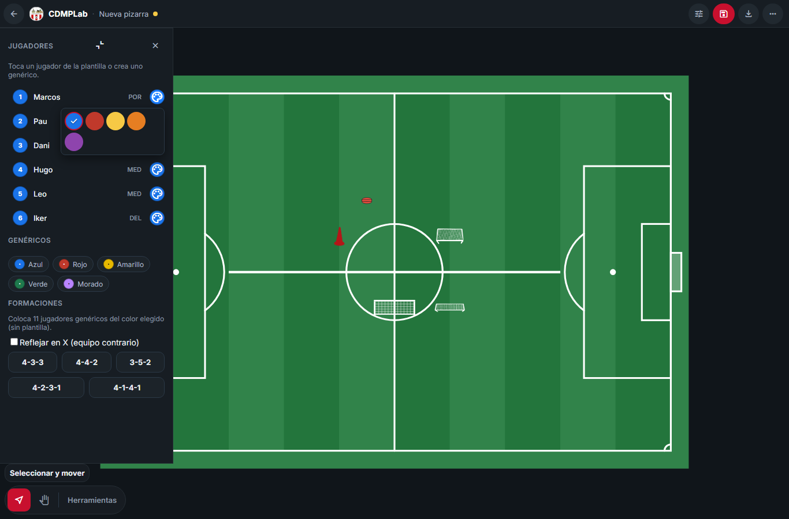
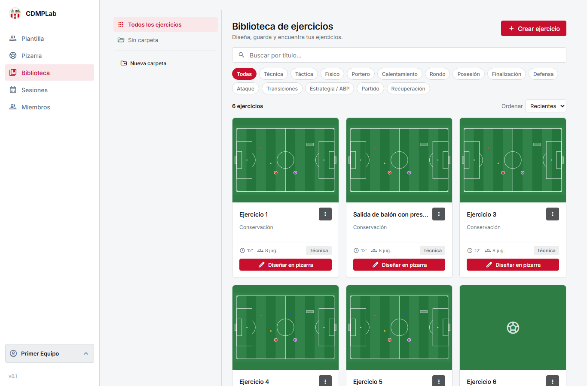

<div align="center">


# CDMPLab

**La pizarra táctica del CDM Pizarrales.**

Dibuja ejercicios sobre el campo, guárdalos en tu biblioteca y compártelos con el cuerpo técnico.

[](https://github.com/Erdeivih/CDMPLab/actions/workflows/ci.yml)
[](https://github.com/Erdeivih/CDMPLab/actions/workflows/pages.yml)
[](https://erdeivih.github.io/CDMPLab/)





</div>

## Qué puedes hacer

- ⚽ **Pizarra a pantalla completa**: jugadores, balones, conos, picas, escaleras, maniquíes, porterías, flechas, formas, texto y dibujo a mano alzada.
- 🎯 **Seis campos**: campo completo, medio campo, tercio, fútbol sala, F7 transversal y lienzo.
- 📚 **Biblioteca con carpetas**: crea, mueve, duplica y busca ejercicios.
- 🗓️ **Sesiones**: encadena ejercicios con tiempos y exporta el PDF de la sesión.
- 👥 **Multiusuario**: un propietario y hasta **6 colaboradores** por equipo, con permisos comprobados **en el servidor**.
- 🔐 **Invita por enlace o por correo**, aprueba cuentas y gestiona quién entra.
- 📱 **Móvil y tableta**: la misma app, con gestos de pellizco, arrastre y panel adaptado.

## Empezar a usarla

**Solo quieres usarla:** entra en **[erdeivih.github.io/CDMPLab](https://erdeivih.github.io/CDMPLab/)**. No hay que instalar nada.

**Quieres ejecutarla en tu ordenador** (necesitas **Node 22**, la CLI de Angular pide 22.22.3 o superior):

```bash
npm install
npm run start        # http://localhost:4200
```

El servidor de desarrollo arranca en **modo local** (los datos se quedan en tu navegador), que sirve para probar. La compilación de producción usa `src/environments/environment.ts`; Pages admite `SUPABASE_URL` y `SUPABASE_PUBLISHABLE_KEY`. Copiar `.env.example` no configura por sí solo Angular. Nunca pongas claves privadas en estos archivos.

## Cómo está hecha

| Pieza    | Tecnología                                          |
| -------- | --------------------------------------------------- |
| Interfaz | Angular 22 con _standalone components_ y `signals`  |
| Datos    | Supabase (PostgreSQL) con **RLS por equipo**        |
| Gráficos | Campo SVG y materiales SVG/PNG                      |
| Pruebas  | Vitest (unitarias) y Playwright (extremo a extremo) |

Todo el estado vive en un único servicio (`StoreService`) y las pantallas nunca hablan con la base de datos directamente: pasan por una capa de datos con contrato propio.

## Comprobaciones

```bash
npm run test:unit          # pruebas unitarias
npm run lint               # ESLint (sin deuda nueva)
npm run format:check       # Prettier
npm run validate:migration # SQL: propiedades de seguridad, estático
npm run test:e2e           # Playwright en desarrollo
npm run test:e2e:pages     # Playwright sobre la build publicada
```

Las mismas puertas corren en **GitHub Actions** en cada `push` (CI + despliegue a Pages). La suite completa de extremo a extremo tarda ~28 minutos y se ejecuta también cada noche.

`npm run test:e2e:prod` comprueba la compilación de producción sin credenciales y también se ejecuta en CI. La suite **opt-in** `npm run test:e2e:supabase-real` sí necesita credenciales de prueba contra la base real; consulta [`docs/supabase-real-e2e.md`](docs/supabase-real-e2e.md). Sus casos dependientes de credenciales se omiten si faltan las variables: no equivalen a un aprobado contra Supabase.

## Dónde está el detalle

Aquí solo está lo esencial. La letra pequeña —y todo lo que **no** está verificado— vive en `docs/`:

| Documento                                                                    | Qué cuenta                                                                          |
| ---------------------------------------------------------------------------- | ----------------------------------------------------------------------------------- |
| [`docs/FASE-10-solicitud-de-equipo.md`](docs/FASE-10-solicitud-de-equipo.md) | Solicitud y aprobación de equipos, gestión de cuentas, administración de plataforma |
| [`docs/correo-invitaciones.md`](docs/correo-invitaciones.md)                 | Correo de invitación: proveedor, estados y qué falta por probar                     |
| [`docs/smtp-supabase-auth.md`](docs/smtp-supabase-auth.md)                   | Correo de registro y recuperación de contraseña                                     |
| [`docs/supabase-estado.md`](docs/supabase-estado.md)                         | Qué migraciones están aplicadas y cuáles no se han podido comprobar                 |
| [`docs/copropiedad-contrato.md`](docs/copropiedad-contrato.md)               | Decisiones aprobadas y comprobaciones necesarias para la copropiedad, aún pendiente |

## Aviso para quien escriba código aquí

Este repositorio tiene reglas propias y **se comprueban**: nada de pruebas silenciadas, nada de reglas rebajadas y ninguna puerta se declara en verde si el proceso devuelve un error. Los comandos de formato y lint son **trinquetes**: exigen impecable todo lo que ya lo estaba (en particular cualquier fichero **nuevo**) y solo toleran, informando de cuánto queda, la deuda que existía antes; nunca crece. `node scripts/lint-check.mjs --list-debt` la lista entera.

## Seguridad (lo importante en una línea)

La barrera real son las **reglas del servidor** (RLS y funciones), no la interfaz: la app solo deja de ofrecer lo que el servidor va a rechazar. Las claves privadas **nunca** van en el repositorio ni en el navegador, y `.env` está ignorado por git.

> ⚠️ Durante el desarrollo se compartieron claves de correo fuera del gestor de secretos. Hay que **rotarlas** antes de ampliar el acceso al cuerpo técnico.

---

<sub>Proyecto independiente. El prefijo `entrenolab:` de `localStorage`, las clases `.entrenolab-*` y el atributo `data-entrenolab-mode` se conservan por compatibilidad con los datos y las pruebas ya existentes: no son texto visible.</sub>
